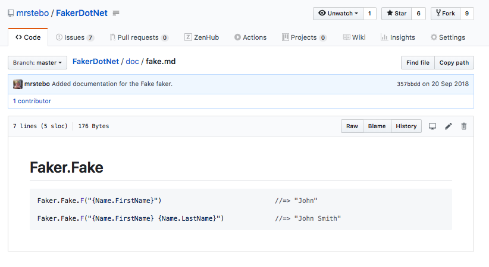
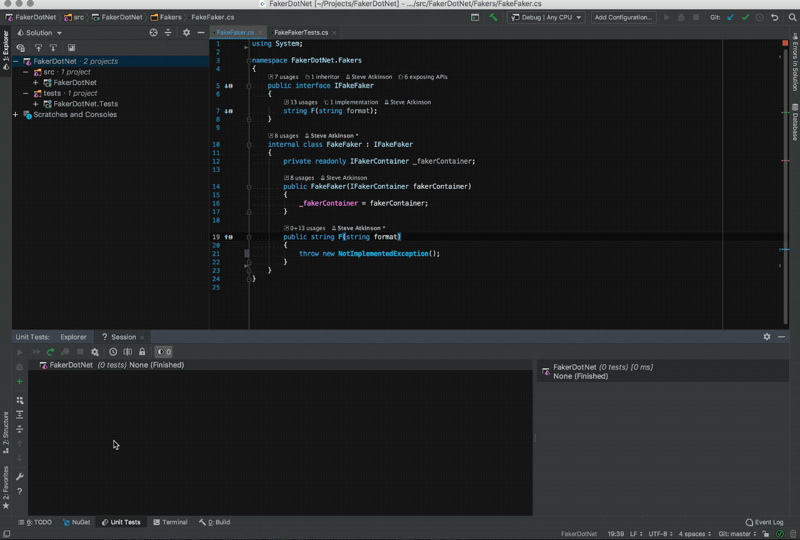
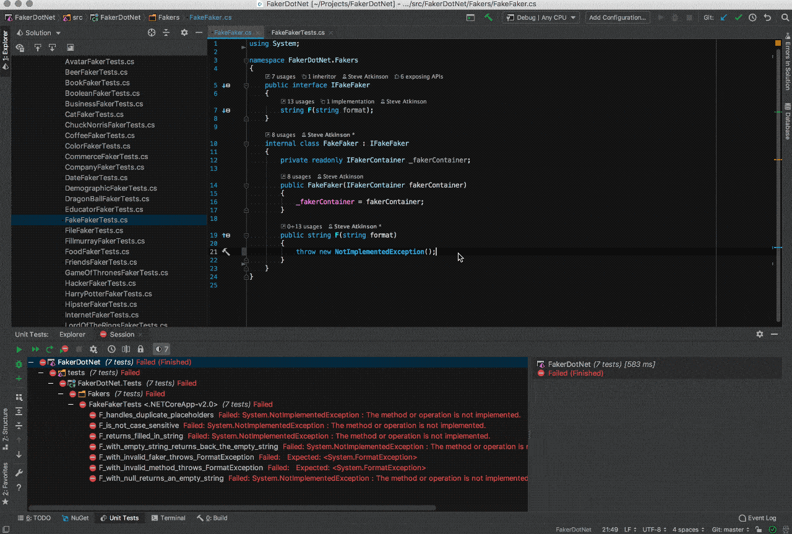

## Reflecting on Reflection in an open source library

---

#### Say @emoji[wave] to
## @color[#DC143C](FakerDotNet)

---?image=assets/images/fakerdotnet_repo.png

---

#### Say another @emoji[wave] to the
## @color[#DC143C](`FakeFaker`)

---

---

### What does it do?

---

@ul

- Looks for @color[#DC143C](**{FakerName.Method}**) in a string
- Replaces with the result of a call to the faker method

@ulend

---

### So this

@size[0.7em]("My name is @color[#DC143C]({Faker.FirstName} {Faker.LastName})")

---

### Turns into this

@size[0.7em]("My name is @color[#DC143C](John Smith)")

---

## How can we implement this?

---

#### The interface

@code[cs zoom-13](assets/code/baseplate/interface.cs)

@[3-6]
@[5](descriptive...right? @emoji[see_no_evil])

---

#### The class

@code[cs zoom-06](assets/code/baseplate/class.cs)

@[9-12](We need to inject the `IFakerContainer`)
@[7](We'll use this later @emoji[wink])
@[14-17](The magical `F` method)
@[16](Right now it doesn't do anything @emoji[sweat_smile])

---

### How do we make sure it works?

---

@snap[west h3-white span-30]
#### @emoji[see_no_evil]
@snapend

@snap[east span-40]
@tweet[https://twitter.com/SwiftOnSecurity/status/685898921063874560]
@snapend

---

#### Unit tests @emoji[tada]

@code[cs zoom-06](assets/code/tests/FakeFakerTests.cs)

@[2](I am using the @color[#DC143C](**FakeItEasy**) package)
@[4](I am using @color[#DC143C](**NUnit**) for the test framework)
@[19-20](These are used by the tests)
@[15](Creating a mockable @color[#DC143C](`IFakerContainer`))
@[16](Then I inject the mock into the @color[#DC143C](`FakeFaker`) class)
@[22-30]
@[32-41]
@[43-52]
@[54-60]
@[62-70]
@[72-80]
@[82-86]

---

---

### A fix that doesn't need reflection

---

---

#### Lets implement this
### @color[#DC143C](without reflection)

---

### What is Reflection?

---

### How is the library using reflection?

---

@snap[north]
#### The final implementation
@snapend

@snap[midpoint span-30]
@code[cs zoom-01](assets/code/reflection/FakeFaker.cs)

@[8-11]
@[13-93]
@[85-92]
@snapend

---
@transition[none]

@snap[north]
#### The final implementation
@snapend

@snap[midpoint]
@code[cs zoom-05](assets/code/reflection/FakeFaker.cs)

@[8-11]
@snapend

---
